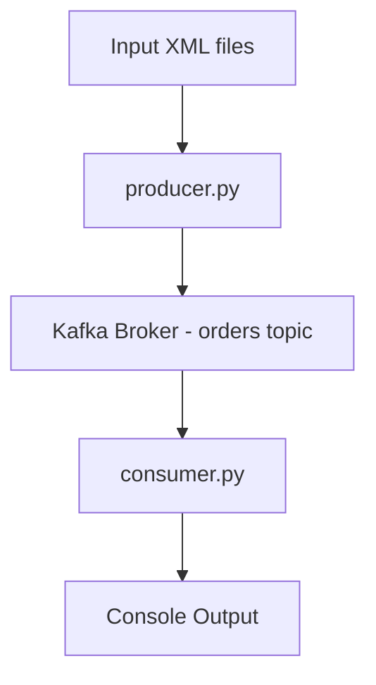

# 💼 My Work/Learning's Highlights — **nitinsriv**
  

<details>

<summary><strong>📌 How to Use This Document</strong></summary>

  

- Each topic is structured as:

1. **Outcome-first summary**

2. **Exact README excerpts (verbatim)**

3. **Representative code / usage**

4. **Simple architecture diagram**

  

</details>

  

---

  

## 🧩 Index

🔴 **Kafka** — Event-driven order ingestion demo

🟣 **AI-Agents** — Prompt-to-code AI Agent CLI

🟢 **Data-Science-IIITB** — R-based academic data science work

  

---

  

# 🔴 Kafka

<mark><strong>Event-driven order ingestion with Apache Kafka</strong></mark>

**Repository:**  [nitinsriv/Kafka](https://github.com/nitinsriv/Kafka)

  

<details>

<summary><strong>🎯 High-level Outcome</strong></summary>

  

✅ **Simple, reliable demonstration of file-driven order ingestion into Apache Kafka using Python.**

  
  

</details>

  

<details>

<summary><strong>⚡ Quick Summary (from README)</strong></summary>

  

> 💬 *"This repository provides example producer and consumer scripts using Apache Kafka for simple order processing based on files containing XML order data."*

  

</details>

  

<details>

<summary><strong>📄 README Excerpts & Usage (Verbatim)</strong></summary>

  

### 📂 Repository Contents

- **producer.py**

> "Watches an `input` directory for new XML files describing orders, extracts their order number and name, and sends these [...]"

  

- **consumer.py**

> "Consumes messages from the `orders` Kafka topic, deserializes the order data, and prints the received messages."

  

---

  

### 🧾 XML Input Format

```xml

<order>

<number>12345</number>

<name>BWG1</name>

</order>

```

---

  

▶️ Commands to Run

  

```python

python producer.py

python consumer.py

```

---

  

📝 **File Summary**

  

### producer.py:

  

- Monitors the input directory for XML files

- Parses order number and name

- Publishes JSON to Kafka topic orders

  

### consumer.py

  

- Subscribes to topic orders

- Prints received JSON messages

  

</details>  <details>  <summary><strong>🛠 Technical Highlights</strong></summary>

 - Language: Python 3.x 
 - Dependency: kafka-python 
 - Environment Kafka broker :: localhost:9092

<mark>Production patterns illustrated:</mark>

 File watching → parsing → Kafka publish
Consumer subscription → deserialization → processing

  

</details>  <details>  <summary><strong>🧱 Architecture Diagram</strong></summary>



</details>

---

# 🟣 Prompt-to-Code AI Agent CLI

<mark><strong>A simplistic programmable implemetation of AI-Agent</strong></mark>

Repository: [nitinsriv/ai-agents](https://github.com/nitinsriv/ai-agents)

  

<details>  <summary><strong>🎯 High-level Outcome </strong></summary>

✅ A compact CLI-based Prompt-to-Code AI Agent

✅ Demonstrates agent-driven code generation using LangChain + OpenAI

✅ Extracts and persists generated code automatically

  

</details>  
<details>  <summary><strong>📄 README Excerpts & Usage (Verbatim)</strong></summary>

🧾 Description

 "An AI Agent which provides a simple command-line interface for generating code snippets using langchain."

  
✨ Features

- Interactive User Prompt  
-  AI Agent Integration
- Markdown Code Extraction
- Automatic Code Saving (output.txt)

  

🧰 Dependencies

- LangChain 
- OpenAI API key via .env
- Python
 
▶️ Run Command

```
python play_webUI.py
```
📌 Example Output

```

Java - implement binary search on a sorted array

Java Code:

public class BinarySearch {

...

}
```
</details>  

<details>  <summary><strong>🛠 Representative Flow & Notes</strong></summary>

 - Extracts first fenced markdown code block 
 - Saves to output.txt Uses
 - regex-based parsing  

⚠️ Extraction assumes markdown format and only captures the first block

  

</details> 

<details>  <summary><strong>🧱 Architecture Diagram</strong></summary>

```mermaid
    graph TD;
    User --> CLI[play_webUI.py]
    
    CLI --> Agent[LangChain + OpenAI]
    
    Agent --> AIResponse[AI Text + Code]
    
    AIResponse --> Extractor[Regex Extractor]
    
    Extractor --> Output[output.txt]
   ```

</details>

---

# 🟢 Data Science (Data preparation, analytics, ML algos)

<mark><strong>Academic Data Science in R</strong></mark>

Repository: [nitinsriv/Data-Science-IIITB](https://github.com/nitinsriv/Data-Science-IIITB)

  

<details>  <summary><strong>🎯 High-level Outcome (Elevator Pitch)</strong></summary>

📊 Data science coursework and labs authored in R, supporting reproducible analysis and use-cases.

  

</details>  <details>  <summary><strong>📦 Repository Metadata</strong></summary>

Language: R (100%)

  

Description: R

  

</details>  <details>  <summary><strong>📚 Expected Contents & Workflow</strong></summary>

✅ R scripts 

✅ Visualizations using tidyverse / ggplot2

 
</details>  

<details>  <summary><strong>🧪 Representative R Snippet</strong></summary>

```R
library(tidyverse)
data <- read_csv('data/student_scores.csv') %>%
mutate(passed = score >= 50)
summary_stats <- data %>%
group_by(course) %>%
summarize(
	mean_score = mean(score, na.rm = TRUE),
	pass_rate = mean(passed, na.rm = TRUE)
)
ggplot(summary_stats, aes(x = course, y = mean_score)) +
geom_col() +
theme_minimal()


```
</details>
